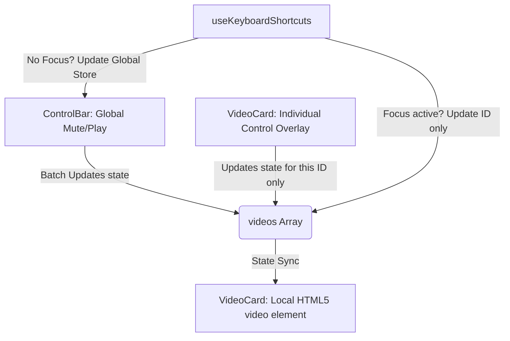

# Technical Architecture: Audio & Playback Synchronization Model

This document explains the synchronization and state model for media playback and audio in the application. It clarifies how global controls, individual video cards, and keyboard shortcuts coordinate without conflicting or causing desynchronizations.

---

## 1. Core State Definition (Zustand & React State)

The application maintains state at two levels: **Global Store** (shared via Zustand) and **Individual Video States** (local properties on each item in the `videos` array).

### Global Store (`useStore.ts`)
- `masterPlaying`: A global flag indicating whether playback is globally active.
- `masterMuted`: A global flag indicating whether audio is globally muted.
- `globalVolume`: A float between `0.0` and `1.0` representing the target volume level.
- `globalRepeat`: A repeat mode setting (`'none'`, `'once'`, `'always'`, `'folder'`).

### Individual Video Card (`VideoItem` interface in `types.ts`)
- `playing`: A local boolean indicating if this specific video is playing.
- `muted`: A local boolean indicating if this specific video is muted.
- `repeatMode`: A local override for repeat mode (defaults to `'none'`).

---

## 2. Synchronization & Isolation Architecture

To prevent global controls and individual overrides from conflicting, the application implements the **Batch-State Propagation Model**:



### A. Global Control Actions (Batching)
When the user clicks the global play/pause or global mute/unmute buttons in the header (`ControlBar`):
1. The global flags `masterPlaying` or `masterMuted` are toggled.
2. The entire `videos` array is updated via a map operation that synchronizes each video's `playing` or `muted` state with the new global state.
   ```typescript
   // Example for Global Play/Pause
   setVideos(prev => prev.map(v => ({ ...v, playing: newState })));
   ```
3. Newly ingested videos (`useIngestion.ts`) or session-restored videos (`useWorkspacePersistence.ts`) read these global states on initialization to inherit the current header state correctly.

### B. Individual Video Card Actions (Isolation)
When the user clicks the play/pause or mute/unmute buttons on an individual `VideoCard` overlay:
1. Only that specific video's properties are updated in state:
   ```typescript
   onUpdateVideo(video.id, { muted: !video.muted });
   ```
2. The global `masterPlaying` and `masterMuted` states remain unchanged. This enables perfect individual isolation.

### C. Volume Scaling and Auto-Unmute
1. The volume of each `<video>` element is bound to `globalVolume`:
   ```typescript
   videoRef.current.volume = globalVolume;
   ```
2. To allow individual unmuted videos to output sound while global mute is active, `globalVolume` is **never** set to `0` when muted.
3. Instead, muting is fully enforced via the element's `muted` attribute.
4. **Auto-Volume Recovery:** If the user clicks the global "unmute" button while `globalVolume` is `0`, the system automatically increases `globalVolume` to `0.5` so that sound is produced immediately without requiring the user to slide the volume up manually.

---

## 3. Dynamic Loop Binding (Folder Cycling & Repeating Fix)

The native HTML5 `loop` property on a video tag tells the browser to repeat playback internally. However, when active, **it completely silences the browser's `ended` event**, rendering playlist transitions, folder cycling, and "repeat once" logic non-functional.

### The Solution:
We dynamically calculate `shouldLoop` depending on the current repeat mode.
- If the repeat mode is `'always'`, native `loop` is set to `true`, providing zero-latency loop playback.
- For any other mode (`'folder'`, `'once'`, or `'none'`), native `loop` is `false`. This allows the browser to trigger the `onEnded` event when the video reaches 100%, letting React handle the next transition.

```typescript
const currentMode = globalRepeat === 'none' ? 'none' : (video.repeatMode !== 'none' ? video.repeatMode : globalRepeat);
const shouldLoop = currentMode === 'always';
```

---

## 4. Pop-Out Player Synchronization

The `PopoutPlayer.tsx` handles isolated rendering in Tauri's popout windows:
- It maintains local `playing` and `muted` React states to feed the custom glassmorphic control overlays.
- Both `muted={muted}` and `loop={repeatMode === 'always'}` are bound directly as React attributes on the `<video>` element to prevent property desynchronization.
- Native mouse-move listeners handle overlay fading, while keyboard event hooks handle controls parity for frame-stepping and snapshot capture.
