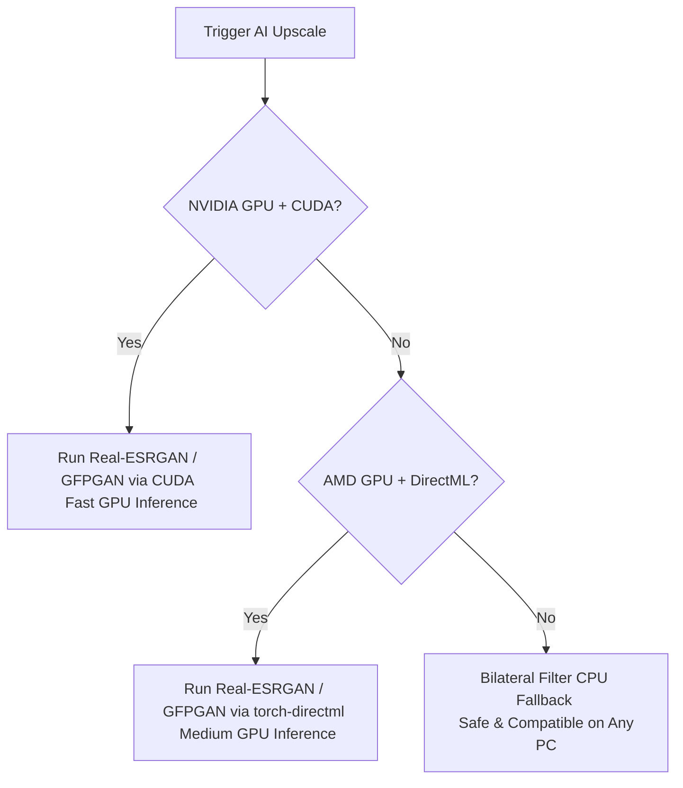

# Cosmo Symphony: Microsoft Store Publishing & Compatibility Guide

This guide details the steps required to publish **Cosmo Symphony** to the Microsoft Store, ensure it works seamlessly across different hardware configurations (NVIDIA, AMD, and CPU-only PCs), and configure Tauri packages for submission.

---

## 1. Multi-PC Hardware Compatibility (NVIDIA, AMD, CPU)

To pass Microsoft Store certification, the application **must not crash** on low-end hardware. The app is pre-configured with a dual-fallback mechanism to ensure compatibility:



### Technical Implementation:
* **NVIDIA GPUs**: Uses PyTorch with native CUDA execution.
* **AMD GPUs**: Uses `torch_directml` which bridges PyTorch to DirectX 12 DirectML API.
* **Other Intel / Integrated GPUs**: Automatically falls back to a multi-stage CPU image processing filter using OpenCV (`cv2.bilateralFilter` + `cv2.GaussianBlur` + `cv2.resize` with cubic interpolation).
* **Threads Capped**: Environment variables cap OpenMP and MKL threads to `2` to avoid system lockups on high-core CPUs.

---

## 2. Preparing for the Microsoft Store

Before packaging the application, you need to register and configure your publisher credentials:

1. **Create a Partner Center Account**: Register as a developer at the [Microsoft Partner Center](https://partner.microsoft.com/dashboard).
2. **Reserve Your App Name**: Reserve "Cosmo Symphony" (or your preferred product name) in the Microsoft Store Console.
3. **Obtain Package Identifiers**: Once registered, go to **Product management > Product Identity** to retrieve:
   - **Package/Identity Name** (e.g., `39247Company.CosmoSymphony`)
   - **Publisher ID** (e.g., `CN=A1B2C3D4-E5F6-7A8B-9C0D-1E2F3A4B5C6D`)
   - **Publisher Display Name** (e.g., `Cosmo Software Studio`)

---

## 3. Packaging Options

The Microsoft Store accepts two package formats for desktop applications:

### Option A: Submission via MSI / EXE Installer (Recommended)
This is the easiest path for Tauri applications. You upload a standard `.msi` or `.exe` installer. Microsoft hosts and delivers the installer to users.

#### Steps:
1. Configure Tauri's MSI builder to use the offline WebView2 installer. Add this to `src-tauri/tauri.conf.json`:
   ```json
   "bundle": {
     "windows": {
       "wix": {
         "language": "en-US"
       }
     }
   }
   ```
2. Build the production installer:
   ```powershell
   npm run tauri build
   ```
3. Upload the resulting `.msi` installer (located in `src-tauri/target/release/bundle/msi/`) directly to the Partner Center under the **MSI/EXE submission** type.
4. **Code Signing**: The Store requires MSI packages to be signed with a trusted certificate (e.g., from SSL.com or DigiCert).

---

### Option B: Submission via MSIX Package (UWP/Modern Desktop wrapper)
MSIX packages run in a lightweight sandbox and provide clean installation/uninstallation.

#### Steps using `tauri-windows-bundle`:
1. Initialize the bundle tooling in your project root:
   ```powershell
   npx @choochmeque/tauri-windows-bundle@latest init
   ```
2. Open `src-tauri/gen/windows/bundle.config.json` and replace the placeholder fields with the **Product Identity** values from your Partner Center:
   ```json
   {
     "identity": {
       "name": "YourPackageName",
       "publisher": "CN=YourPublisherID",
       "version": "4.0.0.0"
     },
     "properties": {
       "displayName": "Cosmo Symphony",
       "publisherDisplayName": "Your Publisher Display Name"
     }
   }
   ```
3. Run the packaging build script:
   ```powershell
   npm run tauri:windows:build
   ```
4. This will output an `.msix` package. Upload this file directly to your store submission dashboard. When submitting an MSIX, the Microsoft Store automatically signs the package with their certificate, removing the need for you to buy an expensive signing certificate.

---

## 4. Hardware System Requirements Declaration

When submitting your app in the Microsoft Partner Center, make sure to configure the system requirements to set expectations for the users:

* **Minimum Requirements**:
  - OS: Windows 10 (version 19041.0 or higher) / Windows 11
  - Architecture: x64
  - Memory: 8 GB RAM
  - Graphics: DirectX 12 compatible GPU
* **Recommended Requirements**:
  - Memory: 16 GB RAM
  - Graphics: **NVIDIA GeForce RTX 30-series / 40-series / 50-series** (for CUDA acceleration) or **AMD Radeon RX 6000/7000 series** (for DirectML acceleration) with at least 8 GB VRAM.
