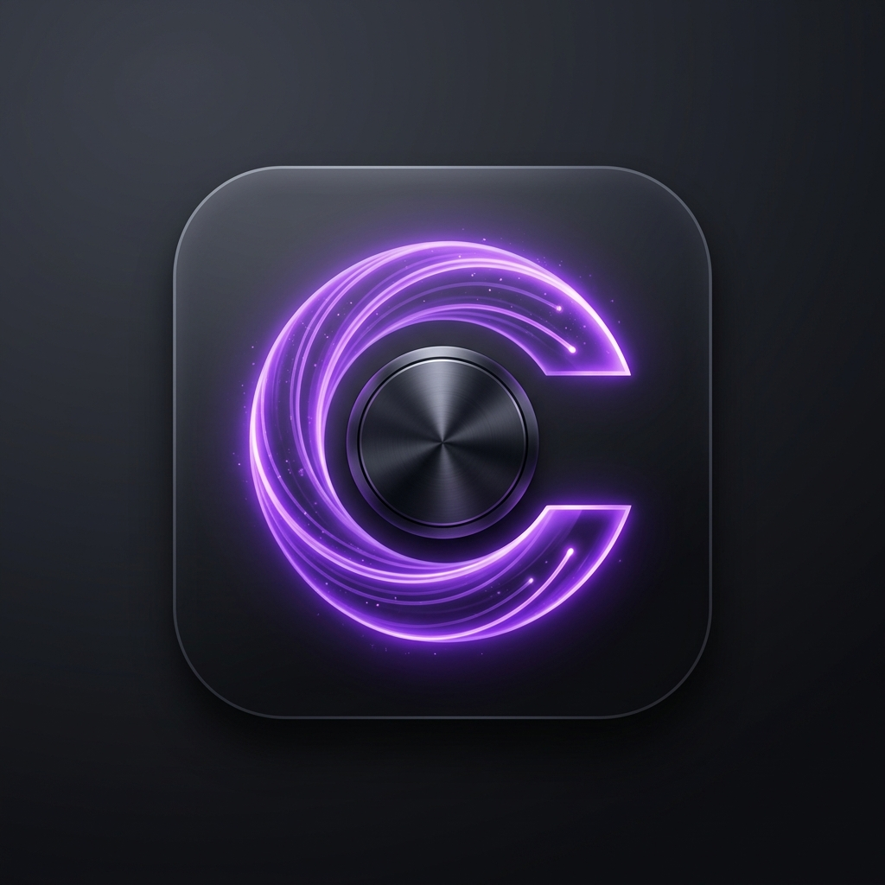

# Cosmo Video Symphony v2.2.0

**Cosmo Video Symphony** is a premium, high-performance multi-video workspace designed for seamless media orchestration and high-density monitoring. Built on Tauri v2, it offers a glassmorphic, hardware-accelerated interface with 100% local sovereignty.



## ✨ Features

- **Symphony Orchestrator**: Unified playback control (Master Play/Mute) across any number of video units.
- **Dynamic Grid**: Drag-and-drop workspace customization powered by `@dnd-kit`.
- **Auto-Rotation**: Intelligent sequence cycling with customizable intervals and session timers.
- **Hardware Telemetry**: Real-time CPU, GPU, and Memory monitoring directly in the status bar.
- **Local Sovereignty**: Zero cloud dependency. All persistence and logs are stored locally.
- **Pop-Out Mode**: Detach any video unit into its own native window for secondary monitor layouts.

## 🚀 Quick Start

### For Users
1.  Download the latest installer: `release/CosmoVideo_v2.2.0.msixbundle`.
2.  Install the developer certificate `release/CosmoVideo_Store.pfx` into **"Trusted People"** (if installing locally).
3.  Double-click the `.msixbundle` to install.

### For Developers
```bash
# Install dependencies
npm install

# Start development mode
npm run tauri dev
```

## 🛠 Tech Stack

- **Core**: Rust (Tauri v2)
- **Frontend**: React + Vite + TypeScript
- **Styling**: Vanilla CSS (Custom Glassmorphism)
- **Animations**: Framer Motion
- **Icons**: Lucide React

## 📖 Documentation

- [Architecture Overview](ARCHITECTURE.md)
- [Developer Guide](DEVELOPER_GUIDE.md)
- [Manus Plan](MANUS_PLAN.md)

## 📄 License
Private Repository - © 2026 Cosmo Video
